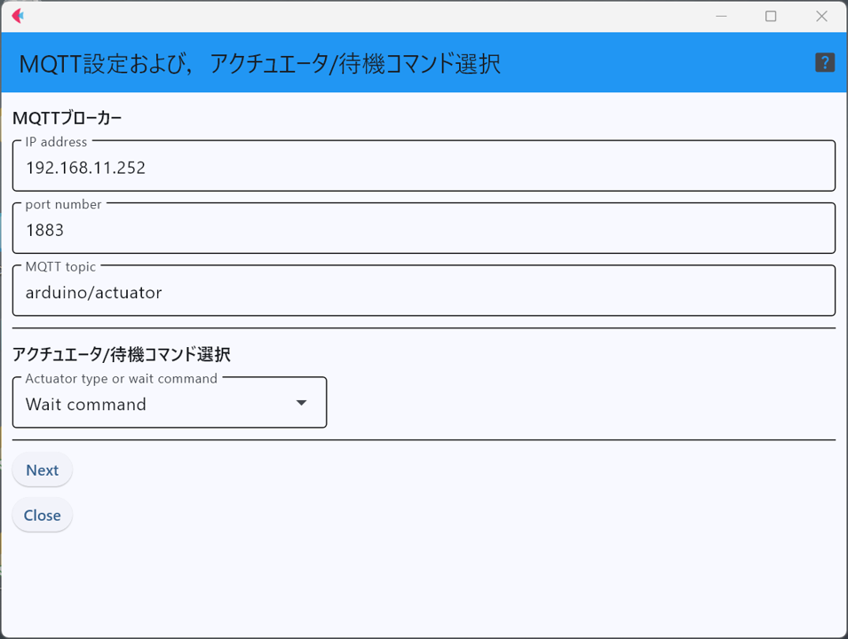
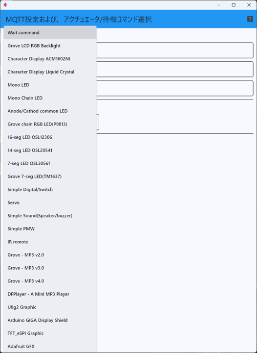
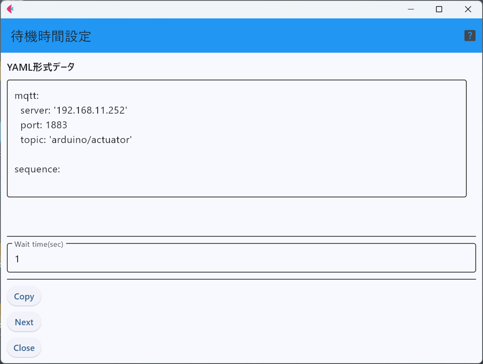
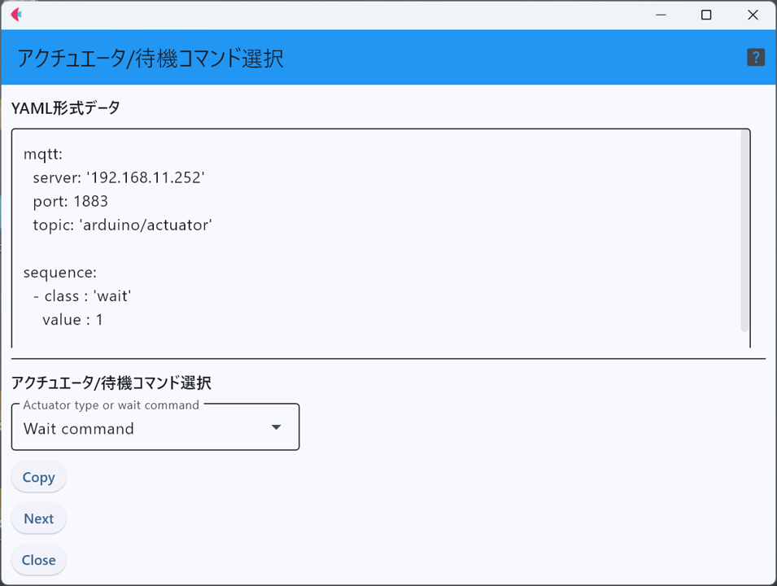
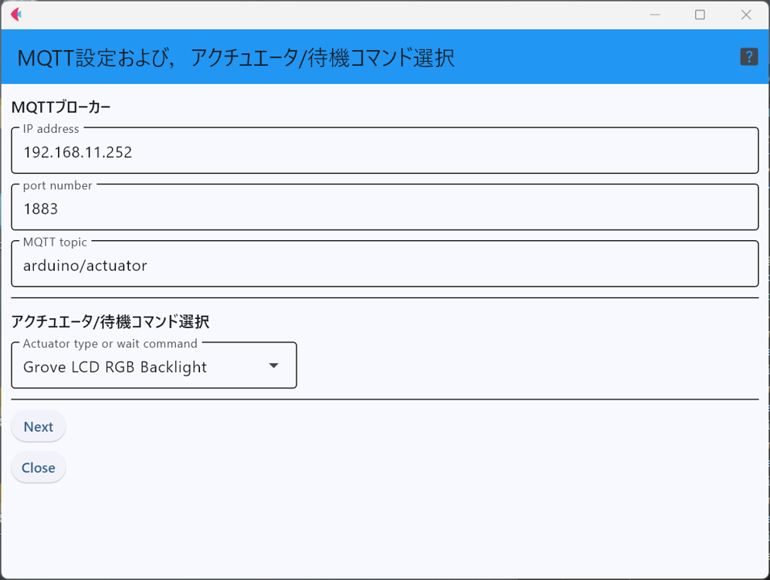
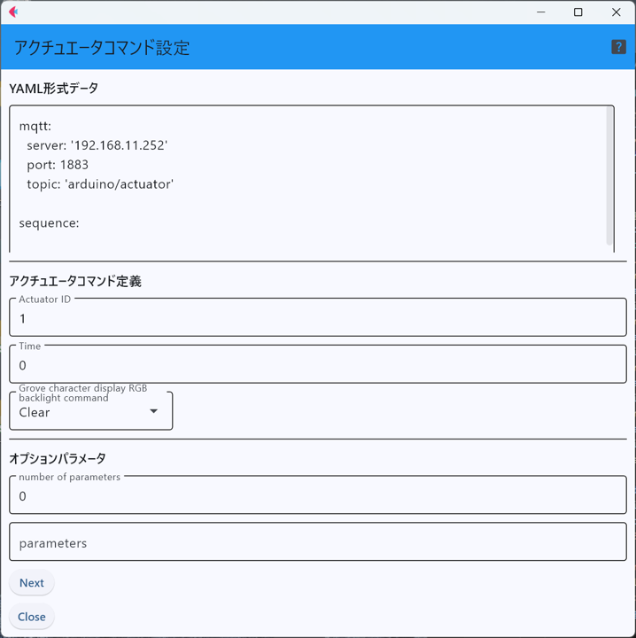
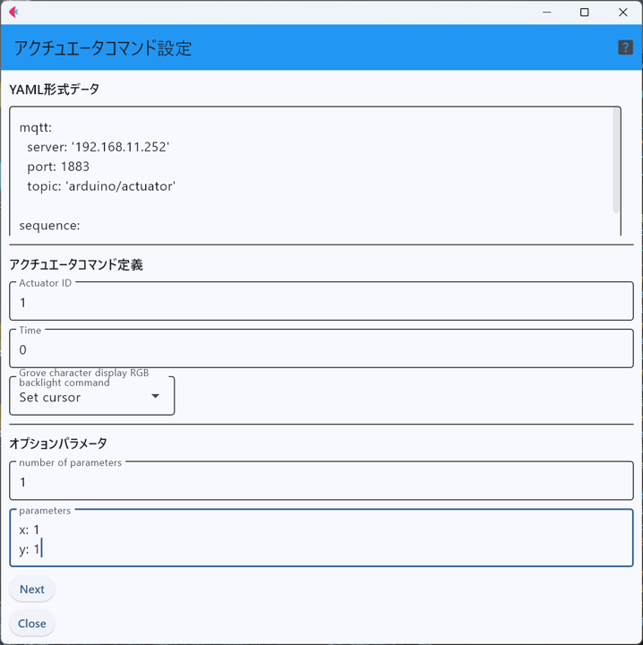
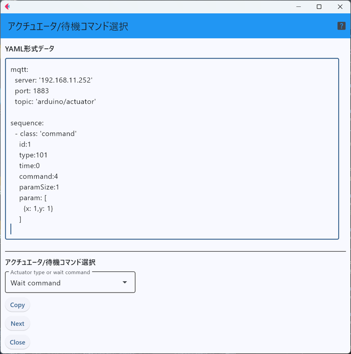

# define_mqtt_sequence

このソフトウェアは，アクチュエータ端末を制御する命令シーケンスを定義し，YAML形式のファイルに保存するための
ヘルパーアプリケーションである．

アプリケーションを起動すると，最初にIoTサーバ(MQTTブローカー)の情報を入力し，
制御対象のアクチュエータ(もしくは待機コマンド)を選択する．

選択可能なアクチュエータは下図の通り．

もし，「待機命令(wait command)」を選択し，「``Next``」ボタンを押すと待機時間(単位は秒)を入力する画面に遷移する．
待機する時間を入力した後，「``Next``」ボタンを押す．

すると，IoTサーバの情報と待機命令の入力内容が，制御命令シーケンスのYAML形式で表現されたものが表示される．
また，シーケンスの次の制御命令を選択するための，アクチュエータ選択メニューも再度表示される．

先ほどの例では，最初の画面で待機コマンドを選択したが，最初の画面で下図のように，「Seeed StudioのRGBバックライト付きキャラクタディスプレイ」を選択
する事例を説明する．

「Seeed StudioのRGBバックライト付きキャラクタディスプレイ」を選択した後，「``Next``」ボタンを押すと，
制御対象のアクチュエータのID，制御命令に付与する時刻情報(ログに残すためのもので，UNIX時間を入力する)，
利用可能な命令を選択するメニューと，メニューで選択されている命令の典型的なパラメータが
表示される．

例えば，制御命令として「カーソルの位置設定」を選択すると，
パラメータ入力欄に自動的に，X軸とy軸の位置情報を入力するためのパラメータが表示される．
これを自分で編集(xとyの値を変更)した後に，「``Next``」ボタンを押す．

「``Next``」ボタンを押すと，下図のような画面に遷移し，それまでに入力した
制御命令シーケンスのYAML形式のテキストが一番上に表示されている．
もし，必要なら，その文字列を自分で編集した上で，「``Copy``」ボタンを押すと，
YAML形式の制御命令シーケンスがクリップボードにコピーされるため，
各自テキストエディタ等を用いて，ファイルにペーストして用いる．

各種のアクチュエータデバイスにおいて，利用可能な制御命令と各制御命令のパラメータの意味等については，
APIのドキュメントを参照すること．

<!--

[ArduinoActuator](https://github.com/ArduinoActuator "ArduinoActuator")

に収録されているHardware Abstraction Layer(HAL)でサポートされている物に加えて，Arduinoの赤外線リモコン用ライブラリ[IRremote](https://docs.arduino.cc/libraries/irremote/ "IRremote")となる．

-->