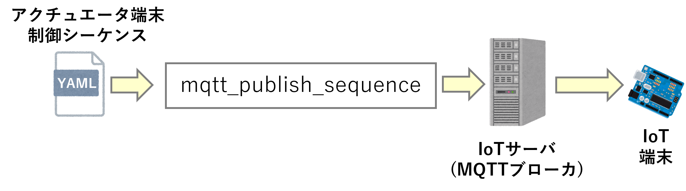
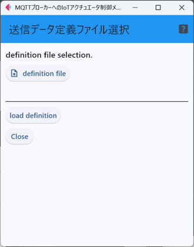
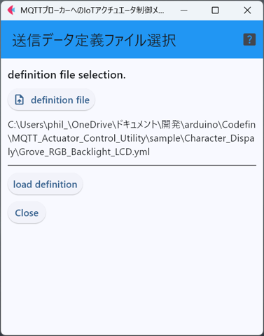
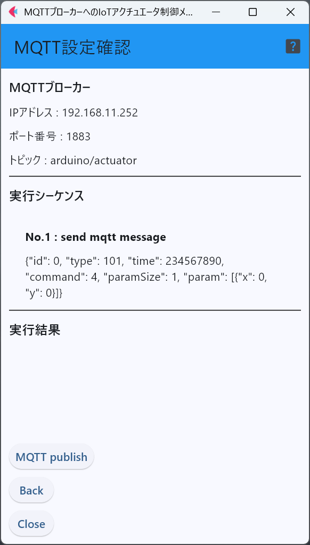
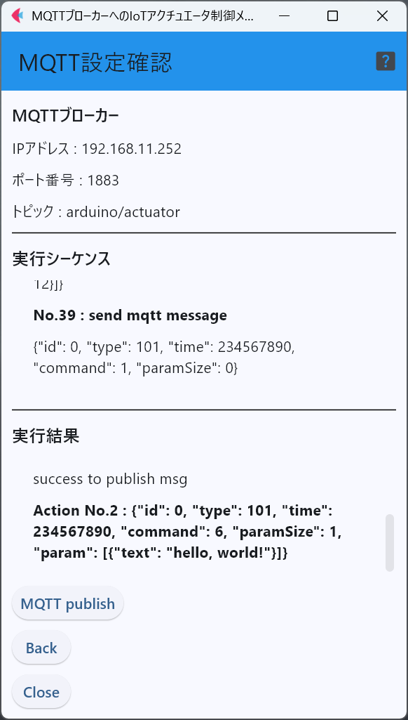

# mqtt_publish_sequence

このアプリケーションは，
YAMLファイルを読み取り，ファイル内に定義されている
制御命令シーケンスに含まれる個々の制御命令をMQTTプロトコルでIoTのサーバに
送信する．

アクチュエータ端末はMQTTプロトコルでサーバから受取り，制御命令に
したがって，端末に接続されている周辺回路を制御する．

このアプリケーションを起動すると下図のような画面が現れる．まずはじめに，
「``definition file``」ボタンを押し，ファイルダイアログを使い，制御命令のシーケンスが
定義されたYAMLファイルを選択する．

ファイルを選択すると，下図のように選択したファイルのパスが画面に表示される．選択したファイルが
間違っていない場合，「``load definition``」ボタンをクリックし，ファイルを読み取る．

ファイルを読み取ると，下図のように，YAMLファイル内の定義(IoTサーバの情報および，制御命令のシーケンス)が
画面に表示される．なお「実行シーケンス」欄はスクロールするため，制御命令のシーケンスを確認することができる．

シーケンスに問題がなければ，「``MQTT publish``」ボタンをクリックすることで，
YAMLファイルに定義されているIoT端末の制御命令をIoTのサーバに送信する．

下図は制御命令をIoTサーバに送信している状態の画面である．「実行結果」欄に送信したメッセージの内容や，送信が成功したか否かが表示される．

<!--

[ArduinoActuator](https://github.com/ArduinoActuator "ArduinoActuator")

に収録されているHardware Abstraction Layer(HAL)でサポートされている物に加えて，Arduinoの赤外線リモコン用ライブラリ[IRremote](https://docs.arduino.cc/libraries/irremote/ "IRremote")となる．

-->