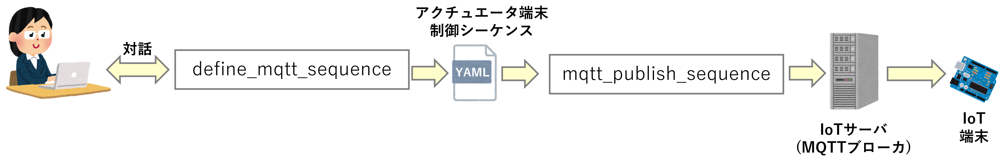

# MQTT_Actuator_Control_Utility

このユーティリティは，MQTTプロトコルを用いたIoTネットワークにおいて，
IoTのアクチュエータ端末を制御するためのものである．

このユーティリティは2つのアプリケーションでできており，「``define_mqtt_sequence``」で
アクチュエータ端末を制御する命令シーケンスを定義し，YAML形式のファイルに保存する．
「``mqtt_publish_sequence``」は，YAMLファイルを読み取り，定義されている
制御命令シーケンスに含まれる個々の制御命令をMQTTプロトコルでIoTのサーバに
送信する．

アクチュエータ端末はMQTTプロトコルでサーバから受取り，制御命令に
したがって，端末に接続されている周辺回路を制御する．

アクチュエータとして利用できる周辺回路は[ArduinoActuator](https://github.com/ArduinoActuator "ArduinoActuator")に収録されているHardware Abstraction Layer(HAL)でサポートされている物に加えて，Arduinoの赤外線リモコン用ライブラリ[IRremote](https://docs.arduino.cc/libraries/irremote/ "IRremote")となる．

